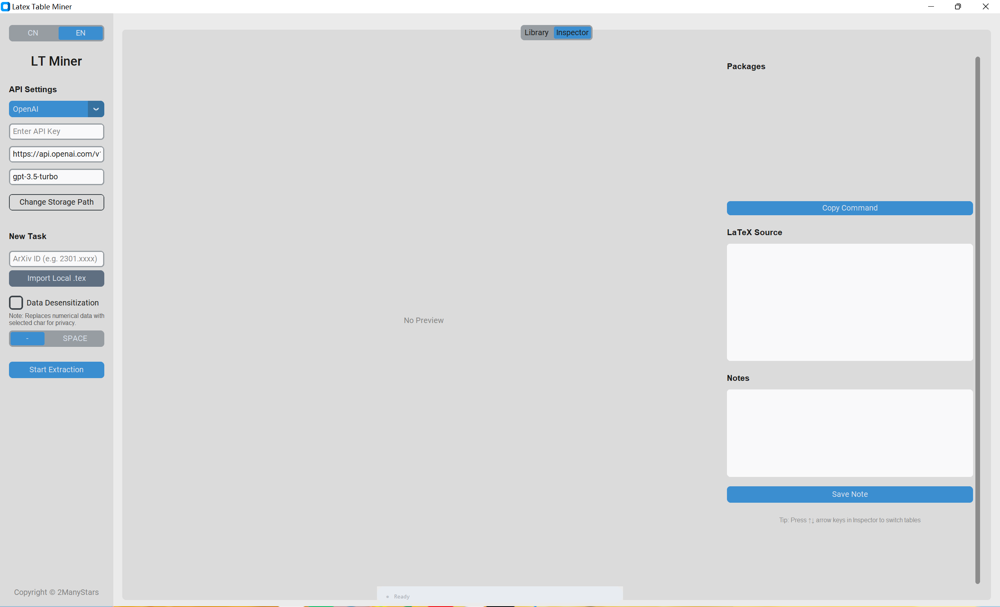

# Latex Table Miner

[English](README.md) | [简体中文](README_CN.md)

 
Latex Table Miner 是一个强大的 Latex 表格提取与管理工具，旨在帮助研究人员和开发者高效地从论文中提取、管理和复用 Latex 表格。

## 📦 功能介绍

本工具提供以下核心功能：

- **arXiv 提取**：直接从 arXiv 论文链接中提取表格源码。
- **本地提取**：支持从本地 Latex 文件中提取表格。
- **管理系统**：提供便捷的表格管理界面，方便查看和整理历史提取记录。
- **备注功能**：支持对提取的表格添加备注，方便后续检索。
- **源码与依赖复制**：一键复制表格的 Latex 源码及所需的宏包依赖。

## ⚙️ 基本原理

本工具采用多阶段处理流程以确保提取的准确性：

1.  **LLM 提取**：利用大语言模型（LLM）初步识别并提取潜在的表格片段。
2.  **正则定位**：使用正则表达式精确通过上下文定位表格在源码中的位置。
3.  **正则 Fix**：通过预设的正则规则修复常见的格式错误。
4.  **LLM Fix**：对于复杂的编译错误，再次调用 LLM 进行智能修复。

## ⚠️ 注意事项与已知问题（Todo List）

由于 Latex 表格的多样性和复杂性，请注意以下几点：

- [ ] **提取成功率**：Latex 表格结构复杂，且环境依赖繁多，因此**不保证每次都能 100% 提取成功**。
- [ ] **渲染显示**：对于一些尺寸较大的表格，预览界面可能无法完全显示（显示不全），但这通常**不影响源码的正确性**。请尝试将源码复制到您的 Latex 编辑器（如 Overleaf）中编译，通常可以正常显示完整的表格。
- [ ] **处理速度**：提取流程可能较慢，特别是当初次提取的源码编译失败，触发 AutoFix 或 LLM Fix 时。界面正下方设有**进度条**，请耐心等待。

## � 安装设置 (重要)

请自行下载 `tectonic.exe` 并将其拖放到 `main.py` 同一路径下。

[下载 Tectonic v0.15.0](https://github.com/tectonic-typesetting/tectonic/releases/tag/tectonic%400.15.0)

## �📝 使用者要求

为了更好地使用本工具，使用者需要具备一定的 **Latex 基础**。

*   为了保证编译的普适性，我们在提取的源码中默认包含了许多常见的依赖项。
*   在复制使用时，建议您具备分辨能力，根据实际需求筛选出重要的组成部分，避免引入不必要的宏包冲突。

## 🤝 贡献与反馈

- **Issue**：如果您在使用过程中遇到任何问题，欢迎提交 Issue 反馈。
- **Pull Request**：欢迎各路高手提交 Branch，共同优化本项目。

## 🚫 版权声明

- **严禁商用**：本项目仅供学习和学术交流使用，**严禁用于商业用途或倒卖**。
- **作者链接**：软件内包含指向本人 GitHub 主页的超链接，欢迎关注。

## 🌟 Star Trend

如果这个工具帮到了你，请给我一个 Star ⭐，这对我是很大的鼓励！

